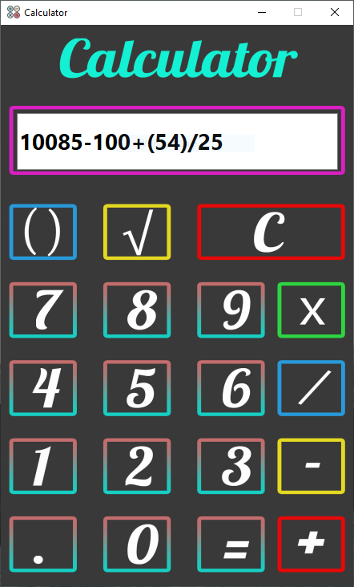

<h1 id="top">Calculator Project - GUI</h1>

<h3>Table Of Contents</h3>
<a href="#sf">Special Features</a> 
<a href="#glry">Gallery</a> 
<a href="#downloads">Downloads</a> 

<h3 id="sf">Special Features</h3>
<ol>
    <li>GUI Application.</li>
		<li>Custom Stack Data Structure</li>
</ol>

<h3 id="glry">Gallery</h3>

<h3 id="downloads">Downloads</h3>
<a href="Snips.rar">Download Gallery</a> 
<a href="Documentation.txt">Download Complete Documentation</a> 
<a href="sudoku_solver.py">Download sudoku_solver.py [main]</a> 
<a href="sudoku.rar">Download Complete Source Code [main, module, resources]</a> 

<a href="#top">Go To Table Of Contents</a>
